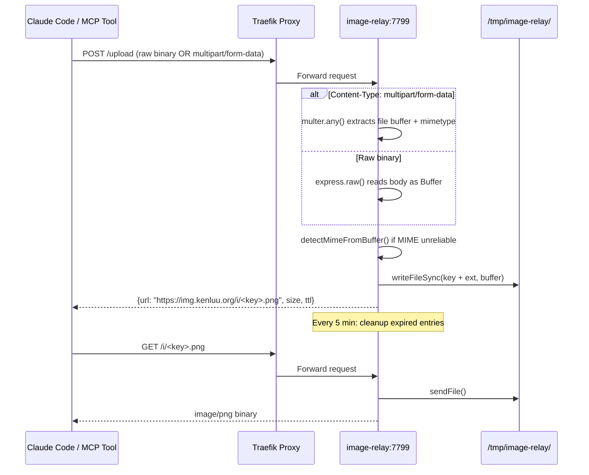

# Architecture

*Mapped: 2026-04-10*

## Project Structure Overview

| Path | Purpose |
|------|--------|
| `server.js` | Express server — upload handler (raw + multipart), download handler, TTL cleanup, magic byte detection |
| `package.json` | Dependencies: express 4.x, multer 1.x |
| `Dockerfile` | Node 22-slim, single-stage build |
| `docker-compose.yml` | Service config: port 7799, Traefik labels, env vars |

## Tech Stack

- **Runtime:** Node.js 22 (slim Docker image)
- **Framework:** Express 4.21
- **Multipart parsing:** Multer 1.4.5-lts.1 (memory storage)
- **Reverse proxy:** Traefik (TLS termination, `img.kenluu.org`)
- **Storage:** `/tmp/image-relay/` (ephemeral, in-container)

## Data Flow

## Entry Points

1. **`server.js`** — the entire application in one file. Start here for everything.
2. **`docker-compose.yml`** — env vars (`PORT`, `BASE_URL`, `TTL_HOURS`, `MAX_SIZE_MB`) and Traefik routing labels.
3. **`Dockerfile`** — build steps, base image.

## Key Design Decisions

- **Dual upload path:** Content-Type sniffing routes to multer (multipart) or express.raw (binary). Both converge to `handleUpload(buffer, mime, res)`.
- **Magic byte detection:** Fallback when MIME is wrong (e.g., `application/octet-stream` for a PNG). Checks first 4-12 bytes for PNG/JPEG/GIF/WebP signatures.
- **In-memory index:** Intentional — this is an ephemeral relay, not a CDN. Container restart = clean slate.
